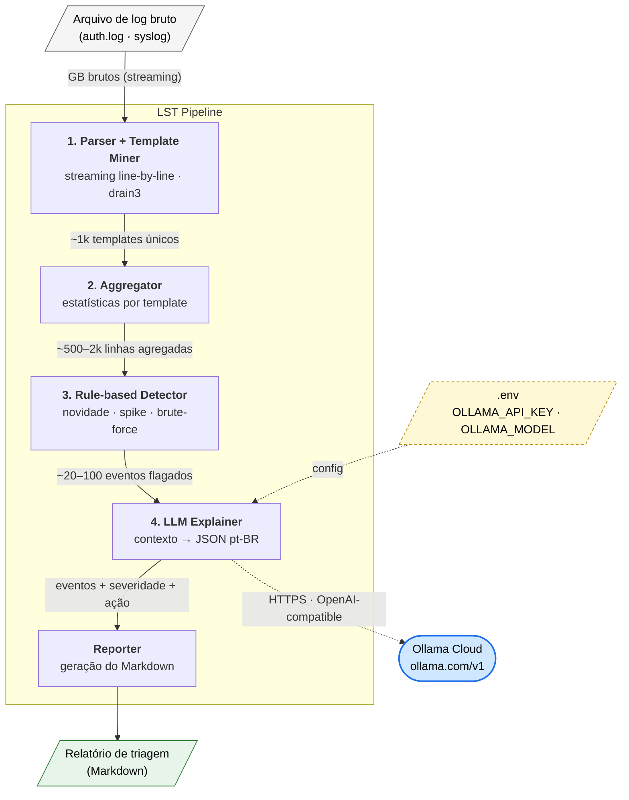

# Arquitetura do LST

Pipeline de 4 estágios que reduz gigabytes de logs de segurança a dezenas de eventos acionáveis, usando LLM apenas na camada de explicação.

```mermaid
flowchart TD
    %% LST (Log Sec Triage) — pipeline de 4 estágios para triagem de logs de segurança
    Input[/"Arquivo de log bruto<br/>(auth.log · syslog)"/]

    subgraph Pipeline["LST Pipeline"]
        direction TB
        Parser["<b>1. Parser + Template Miner</b><br/>streaming line-by-line · drain3"]
        Aggregator["<b>2. Aggregator</b><br/>estatísticas por template"]
        Detector["<b>3. Rule-based Detector</b><br/>novidade · spike · brute-force"]
        Explainer["<b>4. LLM Explainer</b><br/>contexto → JSON pt-BR"]
        Reporter["<b>Reporter</b><br/>geração do Markdown"]
    end

    Output[/"Relatório de triagem<br/>(Markdown)"/]

    Ollama(["Ollama Cloud<br/>ollama.com/v1"])
    Env[/".env<br/>OLLAMA_API_KEY · OLLAMA_MODEL"/]

    Input -->|"GB brutos (streaming)"| Parser
    Parser -->|"~1k templates únicos"| Aggregator
    Aggregator -->|"~500–2k linhas agregadas"| Detector
    Detector -->|"~20–100 eventos flagados"| Explainer
    Explainer -->|"eventos + severidade + ação"| Reporter
    Reporter --> Output

    Explainer -.->|"HTTPS · OpenAI-compatible"| Ollama
    Env -.->|"config"| Explainer

    style Ollama fill:#cfe8ff,stroke:#1f6feb,stroke-width:2px,color:#000
    style Env fill:#fff8d6,stroke:#b58900,stroke-dasharray:4 3,color:#000
    style Input fill:#f5f5f5,stroke:#555,color:#000
    style Output fill:#e6f4ea,stroke:#2e7d32,color:#000
```
