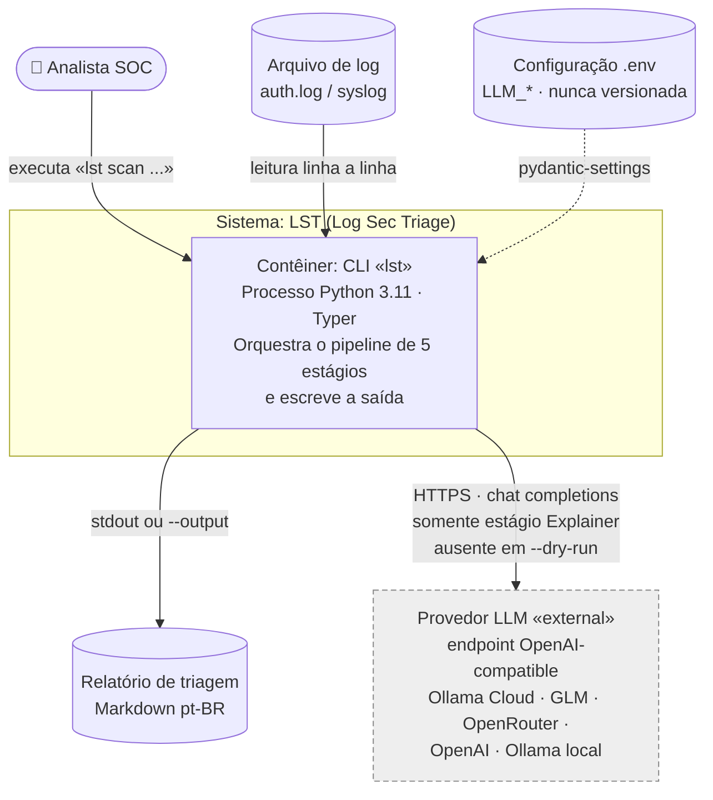
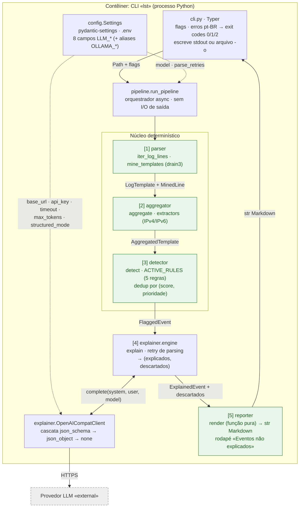
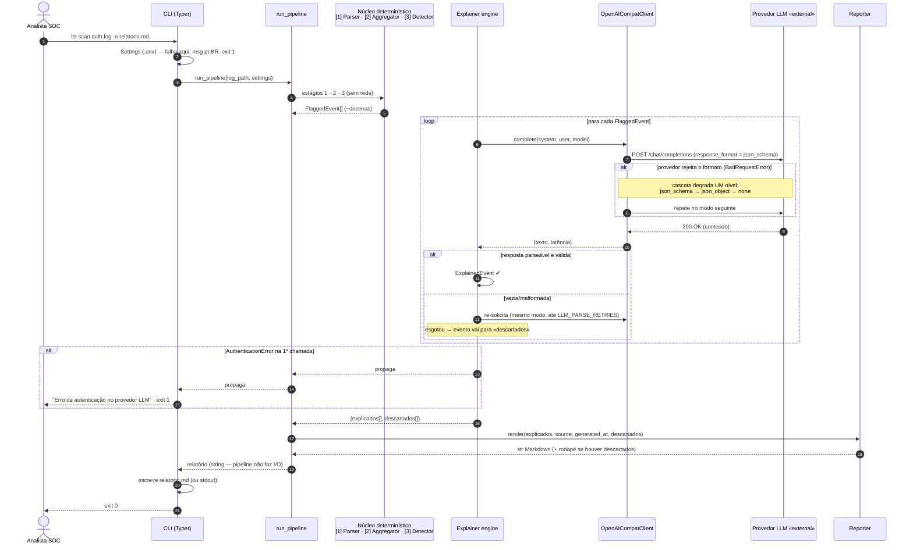

# LST — Discovery de Documentação (Diagrams as Code)

> Base de documentação arquitetural do **LST (Log Sec Triage)** produzida em uma
> fase de discovery assistida por IA generativa, pensada para servir de
> **contexto para agentes de desenvolvimento** implementarem e evoluírem o
> sistema com aderência à arquitetura documentada.

**Local no repositório:** `docs/discovery/README.md`
**Versão do sistema:** v1.2.0 (main `a22b7d7`) · **Data:** 21/08/2026
**Notação:** Mermaid (renderização nativa no GitHub — o diagrama revisa em PR como qualquer código)

---

## Método

Seguiu-se o fluxo de *diagrams as code* da Unidade III (descrição → lacunas e
suposições → geração → revisão → registro), com uma etapa adicional que este
projeto permite: **verificação contra o código real**. A IA generativa usada
foi o modelo Anthropic Opus 4.6, o mesmo do assistente Claude Code que atua como arquiteto consultivo
do projeto; os rascunhos foram gerados a partir da descrição em linguagem
natural e, em seguida, **cada afirmação estrutural e comportamental foi
conferida no código-fonte** (tag v1.2.0).

---

## 1. Descrição em linguagem natural (roteiro)

**Escopo.** O LST é uma ferramenta de linha de comando que faz **pré-triagem
de logs de segurança** (formato syslog/`auth.log`) para analistas SOC: reduz um arquivo bruto a dezenas de eventos suspeitos, explicados
e priorizados em português. Entram no escopo: leitura do arquivo, mineração de
padrões, estatísticas, detecção por regras, explicação via LLM e relatório
Markdown. Ficam fora: coleta/transporte de logs, resposta automática a
incidentes, persistência entre execuções e interface gráfica.

**Nível da visão.** Este documento cobre três visões, uma por diagrama, sem
misturar níveis (disciplina C4): **contêineres** (o processo CLI e seu
entorno), **componentes** (os módulos dentro do processo) e **comportamento**
(sequência da jornada crítica). O nível *code* fica com o próprio código e
seus docstrings.

**Limites e responsabilidades.** Um único processo Python 3.11 organiza um
pipeline de 5 estágios com fronteiras nítidas: **[1] Parser + Template Miner**
(leitura linha a linha + agrupamento drain3), **[2] Aggregator** (estatísticas
por template; extração de IPs v4/v6 e usuários), **[3] Detector** (5 regras
determinísticas registradas em `ACTIVE_RULES`; deduplicação por
score+prioridade), **[4] Explainer** (único estágio com rede: LLM explica cada
evento marcado), **[5] Reporter** (função pura → Markdown). A CLI (Typer)
trata flags, mapeia erros para mensagens pt-BR com exit codes (0/1/2) e **é
quem escreve a saída**; a configuração vem de `Settings` (pydantic-settings,
`.env`). Os estágios se comunicam **exclusivamente por schemas Pydantic
imutáveis** encadeados: `LogTemplate → AggregatedTemplate → FlaggedEvent →
ExplainedEvent`.

**Invariante central:** a detecção é 100% determinística; o LLM existe **só**
na camada de explicação. Nenhum componente além do Explainer pode depender do
provedor.

**Integrações externas.** Uma única: o **provedor LLM**, via endpoint
HTTP compatível com o padrão OpenAI (chat completions). O provedor é
intercambiável por configuração (`LLM_BASE_URL`/`LLM_MODEL`/`LLM_API_KEY`) —
Ollama Cloud (default), GLM Coding, OpenRouter, OpenAI, ou Ollama local
(rota 100% on-premises). O structured output é negociado por cascata
(`json_schema → json_object → none`), com retry de parsing para respostas
vazias/malformadas e rodapé de "Eventos não explicados" quando tudo falha.

**Restrições.** (a) *Invariante* acima — dependência `Detector→LLM` é
proibida; (b) *LGPD/minimização*: no máximo 3 amostras de IPs/usuários/linhas
por evento saem da infraestrutura; `--dry-run` opera sem rede; (c) *equipe de
1* — complexidade operacional é custo de primeira ordem; (d) *qualidade
inegociável*: mypy `--strict`, ruff, 197 testes (~96%), CI a cada push;
(e) *contratos estáveis*: aliases `OLLAMA_*` e `rule_ids` públicos não quebram.

**Lacunas (registradas, não preenchidas).** (i) O leitor é um gerador, mas o
orquestrador atual **materializa as linhas em memória** — a promessa
"multi-GB por streaming" do README vale para o design do reader, não para o
`run_pipeline` de hoje; decidir se é dívida a corrigir ou limitação a
documentar. (ii) `docs/architecture.md` diz "pipeline de 4 estágios" enquanto
README e código dizem 5 — divergência a reconciliar. (iii) Concorrência no
Explainer, ingestão JSON e persistência entre execuções estão no roadmap, sem
decisão registrada. (iv) Não há mecanismo automatizado que *imponha* o
invariante (ex.: lint de imports) — hoje ele vive em revisão humana e testes.

---

## 2. Suposições declaradas (antes dos diagramas)

1. **Notação:** "visão de contêineres inspirada no C4" foi desenhada em
   `flowchart` Mermaid estilizado, não na sintaxe C4 experimental do Mermaid —
   decisão de portabilidade de renderização (GitHub/GitLab/VS Code). Externos
   são marcados com «external» e traço tracejado.
2. **Um contêiner só:** o LST é um monolito CLI; o nível de contêiner mostra
   honestamente **um** contêiner executável + armazenamentos em arquivo +
   integração externa. Inflar contêineres seria inventar arquitetura.
3. **Volumes nas arestas** ("~centenas de templates", "~dezenas de eventos")
   são ordens de grandeza observadas nas fixtures, não SLAs.
4. **GitHub Actions (CI)** não aparece nos diagramas de runtime: é infra de
   qualidade, não dependência de execução.

---

## 3. Diagrama estrutural — nível Contêiner (C4-inspirado)

**Leitura:** a única fronteira de rede do sistema é a aresta CLI→Provedor, e
ela pertence exclusivamente ao estágio Explainer — em `--dry-run` essa aresta
não existe. Tudo o mais é filesystem local.

---

## 4. Diagrama estrutural — nível Componente (dentro do contêiner CLI)

**Leitura:** os componentes verdes são determinísticos e sem rede (o Reporter
inclusive é função pura). A configuração flui do `Settings` em dois pontos
distintos: parâmetros de orquestração para o pipeline e parâmetros de
transporte para o cliente. **Não existe aresta de [1]/[2]/[3]/[5] para o
provedor** — essa ausência é o invariante central, e é critério de revisão.

---

## 5. Diagrama comportamental — sequência da jornada crítica

Jornada: `lst scan /var/log/auth.log -o relatorio.md` (caminho de sucesso,
degradação da cascata, descarte após retries e falha de autenticação).

**Notas de comportamento verificadas no código:** em `--dry-run` o laço de
explicação inteiro é substituído por placeholders locais (`severity=medium`,
`llm_model="dry-run"`), `descartados=[]` e **nenhuma** mensagem sai para a
rede. Sobre idempotência: o scan é somente-leitura sobre o log (o único efeito
é sobrescrever o arquivo `-o`); retries e reexecuções não duplicam efeitos —
custam apenas tokens.

---

## 6. Decisões e ajustes sobre o que o modelo gerou

Registro fiel do que a verificação contra o código mudou no rascunho — a
parte do exercício que transforma geração em engenharia:

| # | Elemento | Rascunho do modelo (a partir da descrição) | Verificação no código | Ajuste final |
|---|---|---|---|---|
| 1 | Escrita do relatório | Aresta `Reporter → arquivo` (o próprio `docs/architecture.md` atual desenha assim) | `render()` retorna `str`; docstring do pipeline: *"No I/O on the return path"*; quem escreve é `cli.py` (`output.write_text` / stdout) | Aresta de escrita movida para a CLI nos 3 diagramas |
| 2 | Streaming | Aresta de entrada rotulada "GB brutos (streaming)" | `run_pipeline` faz `lines = list(iter_log_lines(...))` — materializa tudo em memória | Rótulo neutro "leitura linha a linha"; promessa multi-GB **não** repetida; lacuna (i) registrada |
| 3 | Contagem de estágios | "4 estágios" (herdado do `docs/architecture.md`) | README, docstrings e logs do pipeline numeram 5 (Reporter = 5º) | Diagramas adotam 5; divergência do doc antigo virou lacuna (ii) |
| 4 | Timeout por chamada | Engine repassando `timeout` ao client a cada mensagem | O pipeline chama `explain(model=…, parse_retries=…)`; o client lê `timeout`/`max_tokens`/`structured_mode` do `Settings` na construção | Config em **duas** arestas tracejadas distintas (Settings→pipeline e Settings→client) |
| 5 | Dry-run | "Pula o Explainer" (sem detalhar) | Gera `ExplainedEvent` placeholder com severidade fixa `medium`, sem instanciar o client | Nota explícita no diagrama de sequência e no texto |
| 6 | Notação C4 | Sintaxe `C4Container` nativa do Mermaid | Suporte de renderização experimental/variável entre plataformas | `flowchart` estilizado C4-inspired (suposição 1) — decisão de portabilidade |
| 7 | Retry vs cascata | Um único mecanismo de "tentar de novo" | São ortogonais: cascata reage a `BadRequestError` de formato (degrada modo); retry reage a 200-OK inválido (mesmo modo) | Dois blocos `alt` separados na sequência, com nota |

---

## 7. Checklist de revisão em PR (para estes e futuros diagramas)

1. Cada diagrama está em **um único nível** (contêiner OU componente OU
   sequência), sem mistura?
2. O provedor LLM está marcado como «external» e tracejado?
3. **Invariante:** não existe nenhuma aresta de Parser/Aggregator/Detector/
   Reporter para o provedor? (A ausência é o critério.)
4. A aresta de escrita da saída parte da **CLI**, nunca do Reporter?
5. O caminho `--dry-run` permanece sem qualquer aresta de rede?
6. As arestas mostram apenas dependências relevantes — sem endpoints, rotas
   ou payloads?
7. Os nomes batem com o código (`run_pipeline`, `OpenAICompatClient`,
   `ACTIVE_RULES`, `explain`, `render`)?
8. Suposições e volumes estão declarados como tal (não como fatos)?
9. O diagrama de sequência mantém sucesso **e** pelo menos uma falha realista
   (cascata, descarte, autenticação)?
10. Divergência encontrada entre diagrama e código virou issue/lacuna
    registrada — nunca "ajuste silencioso" no desenho?
11. Mudança de arquitetura no código veio acompanhada do diff correspondente
    no `.md` do diagrama (rastreabilidade)?
12. O Mermaid renderiza no GitHub (sintaxe válida) antes do merge?

---

## 8. O que falta para um agente implementar sem inventar decisões

O que **já existe** e onde (o agente deve receber junto): contratos de dados →
`src/lst/schemas.py` (frozen, validados); fórmulas e thresholds das 5 regras →
`docs/detection_rules.md`; o que sai para o LLM e o prompt literal →
`docs/prompting.md`; tabela de configuração com defaults e faixas → `README`;
convenções de commit/versão → histórico + `CHANGELOG`; gates de qualidade →
`pyproject.toml` + `.github/workflows/ci.yml`.

O que **ainda falta** (lacunas que fariam um agente inventar):

1. **ADRs como arquivos versionados.** Os porquês vivem em corpos de commit e
   em documentos externos — agentes não leem `git log` por padrão. Migrar as
   decisões-chave (cascata, aliases, rodapé, fixture congelada) para
   `docs/adr/NNN-*.md`.
2. **Invariantes executáveis.** Transformar o invariante central em checagem
   de CI (ex.: proibir `import openai` fora de `explainer/` via regra de
   lint/teste) — a "validação automatizada" que a unidade prescreve para
   diagramas vale para a arquitetura toda.
3. **Contrato de calibração de testes.** As contagens exatas das fixtures
   (3 flags na principal, 2 na IPv6) são contrato, não acidente — declarar
   isso num doc de testes para o agente não "consertar" números que são
   especificação.
4. **Glossário de nomes públicos estáveis** (`rule_ids`, aliases `OLLAMA_*`,
   campos do relatório): o que um agente **não pode renomear** sem major
   version.
5. **Mapa erro→exit code→mensagem pt-BR** como especificação (hoje inferível
   só lendo `cli.py`).
6. **Fronteira decisão × liberdade:** o que é decisão registrada (intocável
   sem ADR novo) versus detalhe de implementação livre — sem essa fronteira,
   agentes ou reabrem decisões ou fossilizam detalhes.

## 9. Manutenção

Estes diagramas são código: vivem neste diretório, mudam por PR com o
checklist da seção 7, e a sintaxe Mermaid pode ser validada no CI. Numa
evolução com MCP (renderizar e comentar diagramas em PR automaticamente),
valem os controles da unidade: menor privilégio, aprovação humana para
merge, segregação de contexto e auditoria das chamadas.
